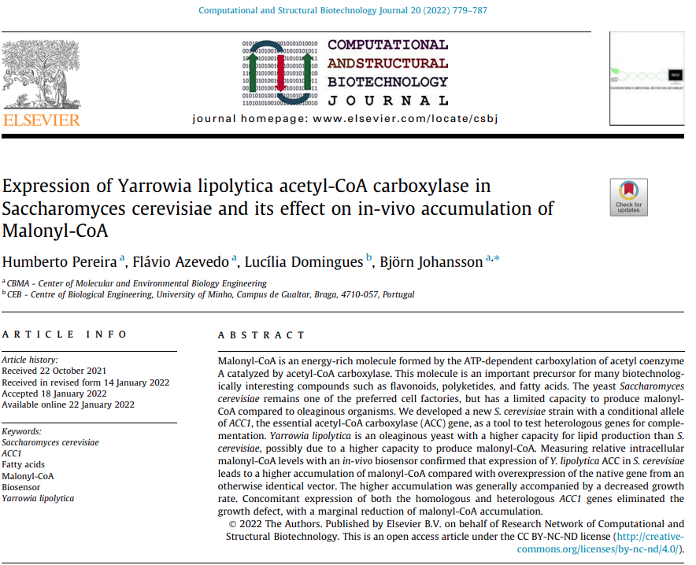

# Pereira et al. 2021

This repository contains Jupyter notebooks describing cloning and construction using
[Python](https://www.python.org) and [pydna](https://github.com/BjornFJohansson/pydna) in
[Jupyter notebooks](https://jupyter.org).

The notebooks and other files in this repository accompany the publication:

Pereira, Humberto, Flávio Azevedo, Lucília Domingues, and Björn Johansson. 2022. “Expression of Yarrowia Lipolytica Acetyl-CoA Carboxylase in Saccharomyces Cerevisiae and Its Effect on in-Vivo Accumulation of Malonyl-CoA.” *Computational and Structural Biotechnology Journal* 20 (January 1): 779–787.

[PubMed](tbd)
[website](https://www.sciencedirect.com/science/article/pii/S2001037022000277?via%3Dihub)

## Main files

- [AccTet.ipynb](AccTet.ipynb)
- [pYPK0_TEF1_ScACC1_TDH3.ipynb](notebooks/pYPK0_TEF1_ScACC1_TDH3.ipynb)
- [pYPK0_TDH3_ScACC1_PGI1.ipynb](notebooks/pYPK0_TDH3_ScACC1_PGI1.ipynb)
- [pYPK0_TEF1_YlACC1_TDH3.ipynb](notebooks/pYPK0_TEF1_YlACC1_TDH3.ipynb)
- [pYPK0_TDH3_YlACC1_PGI1.ipynb](notebooks/pYPK0_TDH3_YlACC1_PGI1.ipynb)
- [pYPK0_TEF1_ScACC1_TDH3_YlACC1_PGI1.ipynb](notebooks/pYPK0_TEF1_ScACC1_TDH3_YlACC1_PGI1.ipynb)
- [pYPK0_TEF1_YlACC1_TDH3_ScACC1_PGI1.ipynb](notebooks/pYPK0_TEF1_YlACC1_TDH3_ScACC1_PGI1.ipynb)

Each notebook contain links (usually in the end) to the resulting sequences.

These notebooks are tested on the github action build service.

This means that the notebook outputs are re-executed and compared with saved
results once per week to ensure [reproducibility](https://en.wikipedia.org/wiki/Replication_crisis).

If the badge below is green, all tests gave the expected results.

The notebooks can be visualized in a number of ways.

The notebooks (.ipynb) can be viewed directly on Github or through the nbviewer service
[here](http://nbviewer.jupyter.org/github/MetabolicEngineeringGroupCBMA/Cunha_et_al_2017/blob/master/notebooks/acctet.ipynb)

Each notebook (.ipynb) is accompanied by a HTML file with the same name but with an (.html)
extension. These static files can be opened in a web browser and viewed without installing any software.

